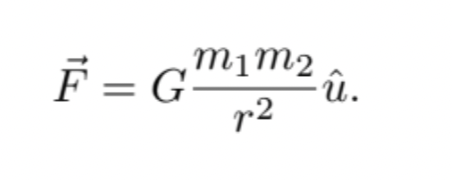
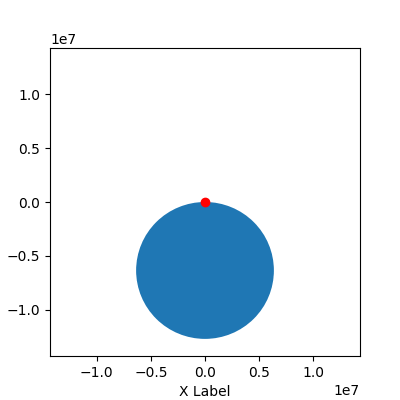

# Simulation of a missile trajectory given initial conditions
### About
Final Project for the Modeling and Simulation 2023-1 class, taught by Dr. Victor de la Luz at the _National Autonomous University of Mexico_ (UNAM), in its  National School of Superior-Level Studies, _Morelia_ Campus (ENES Morelia), as part of its _Bs. in Information Technologies applied to Science_ career plan.

**Developed by:**
> 
> Miriam Guadalupe Valdez | mirluvams@gmail.com | ([@mirluvams](https://github.com/mirluvams))
> 
> Luis Aarón Nieto Cruz | aaronnicruz@gmail.com | ([@LuisAaronNietoCruz](https://github.com/LuisAaronNietoCruz))
> 
> Arely Hilda Luis Tiburcio  | arelyhildalt@gmail.com | ([@areelu](https://github.com/areelu))

### License

*The contents of this repository are licensed under the GNU General Public License version 3. Visit https://www.gnu.org/licenses/gpl-3.0.html for more information.*

*Copyright © 2022 <mirluvams@gmail.com, aaronnicruz@gmail.com, arelyhildalt@gmail.com>*

*Permission is hereby granted, free of charge, to any person obtaining a copy of this software and associated documentation files (the “Software”), to deal in the Software without restriction, including without limitation the rights to use, copy, modify, merge, publish, distribute, sublicense, and/or sell copies of the Software, and to permit persons to whom the Software is furnished to do so, subject to the following conditions:*

*The above copyright notice and this permission notice shall be included in all copies or substantial portions of the Software.*

## Introduction
The following project aims to model the trajectory of a parabolic shot between M and W at an initial velocity of 7000 m/s, with a mass of 70 tons, at a 45° of angle, thrust by calculating the drag force in an atmosphere with polar trajectory.

### Objective
Generate a series of graphs which accurately predict and simulate the trajectory of a missile with the given initial conditions, in order to estimate the time, distance, and velocity of flight. Additionaly, compose said images into a gif.

### Toolset
The project is to be developed by making use of C standard.
* [ISO C 98](https://www.iso.org/standards.html)

### Methodology
Newton's Law of Universal Gravitation states that every particle attracts every other particle in the universe with force directly proportional to the product of the masses and inversely proportional to the square of the distance between them. The gravity force is defined by:

Where:
> F: gravitational force
> 
> m1 & m2: masses of the two objects, in this case, the mass of the missile and the mass of the Earth.
> 
> r: separation between the two objects, in this case, the Earth radius.
> 
> G: universal gravitational constant
> 
>u:
>
The growth rate depends on a growth coefficient multiplied by the response capacity of the population.

Once separated, the dynamic system can be fitted accordingly with our data, as obtained in the data source described above. This was achieved by making use of scipy's implementation of Levenberg-Marquard minimization. Where:
>
> P(0): 

### Run
Execute [main.c](main.c) using a terminal with the packages mentioned above. 
> Use the cat command on Linux ....

### Results
Using L-M minimization, we found the following parameters:

For overweight (OW): 
r = 0.10457, K = 25105894.30522

For obesity (OB): 
r = 0.10763, K = 28892092.21548

For overweight and obesity: 
r = 0.08692, K = 56037606.60947

### Conclusions

### References 
